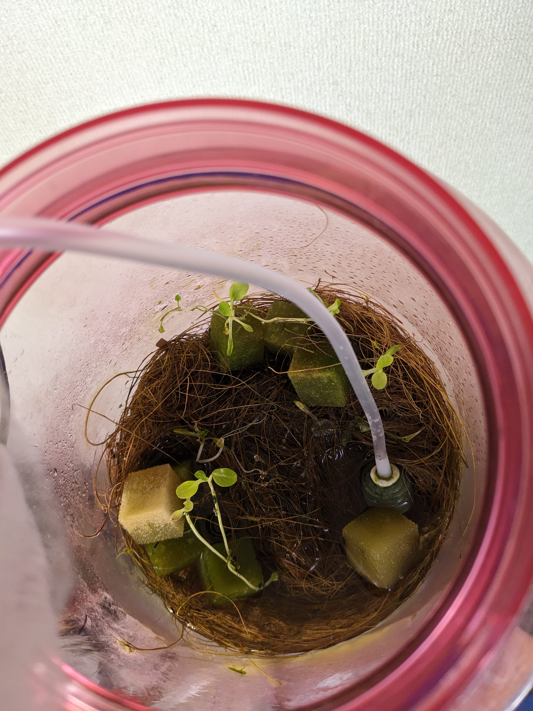
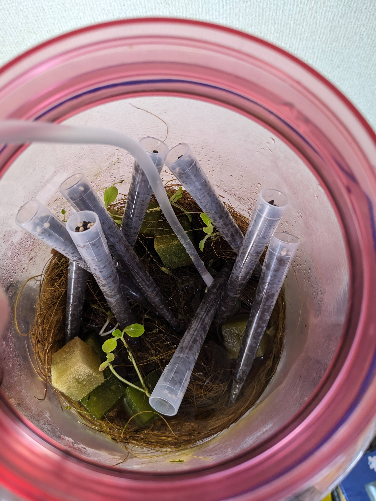
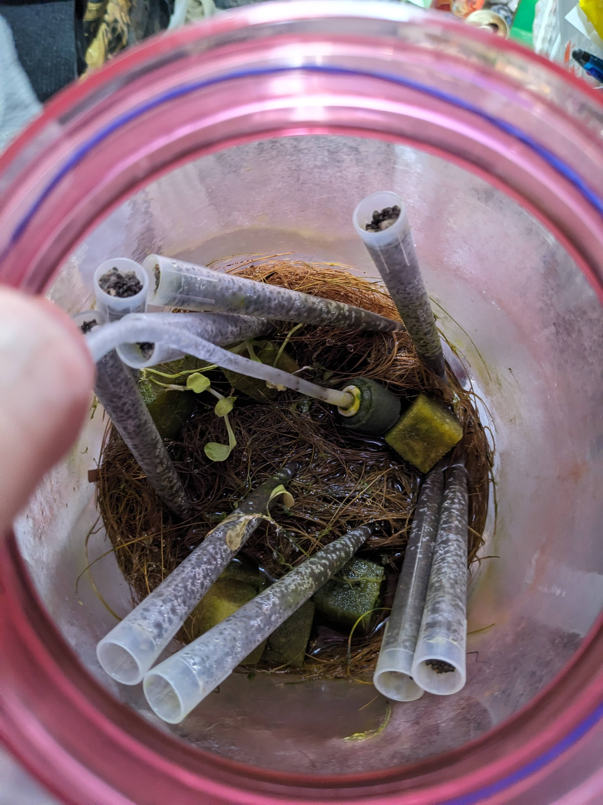
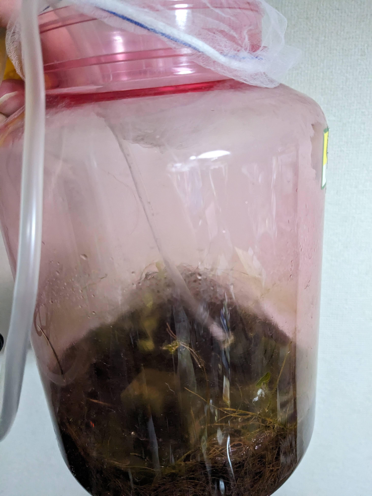
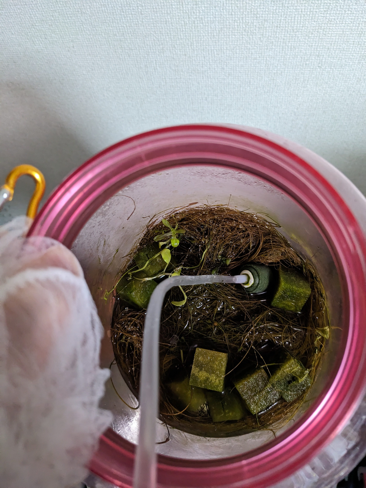
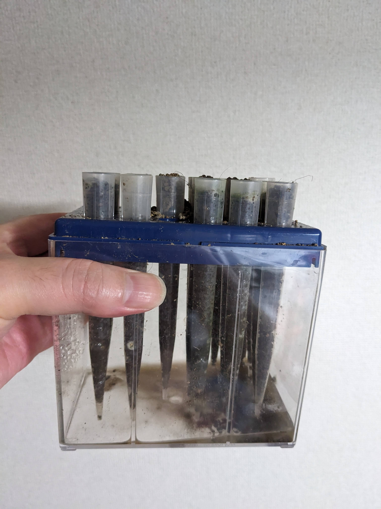
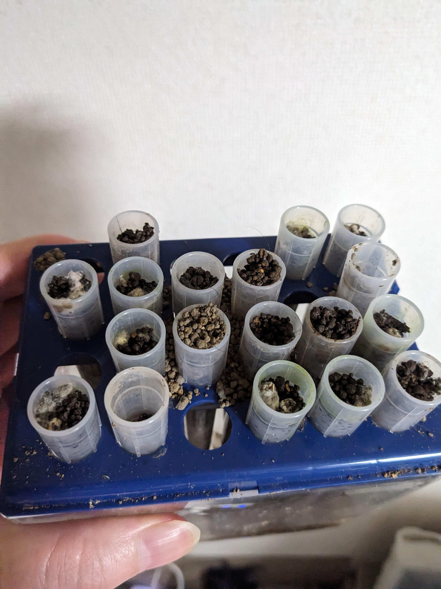

# アブストラクション
この原稿は、宇宙空間での植物栽培に必要と思われる閉鎖空間における水耕栽培方式での植物の種発芽試験を途中経過ではあるが纏めたものである。
宇宙農業の是非については、拙稿(https://github.com/busyoucow/spacefarm)及び(https://github.com/busyoucow/AnotherSpaceFarm)を参照されたい。
現在のところ瓶内発芽試験のチンゲンサイとパクチーに関しては発芽し四つ葉をつけるところまでは成功。キヌアに関しては発芽前の根が出るところまで成功している。

  

# はじめに

# 閉鎖空間(瓶)内での発芽試験記録
## 用意したもの
- *プラスチック瓶(蓋をしたまま一部を解放できるもの)
- チンゲンサイとパクチーの種
- 根を固定するホルダー
- *種を保水格納するスポンジ

後に以下のものも用意した。

- ストッキングネット(防虫用)
- 固定用ヤシがら
- 植物向け総合液体肥料
- *LEDライト(USB給電)
- *LEDライト(AC給電)
- *エアーポンプ(USB給電)
- 6-10-5植物用液肥

  
  
  
  
  
  
  
 *のついているもの以外は100均にて入手した。

## 瓶内発芽試験開始
開始初日 2024年8月26日 最高気温35℃以上 最低気温25℃ 在室時のみクーラー使用 チンゲンサイとパクチーの種をスポンジに埋めて水に浮かべた 当然芽は出ていない

  

7日間経過 芽が出てきた

  

14日間経過 豆苗のようにひょろひょろと伸びる 四つ葉が見えてくる 転倒の恐れがあったためヤシがらを敷き液肥を付加する

  

46日間経過 2024年12月17日 枯れた芽もあるが残っている芽もある 新しく種を追加している

  

190日間経過 2025年2月21日 最高気温9℃ 最低気温1℃ エアコンなど暖房器具稼働なしだが室温は25℃以上あった もうチンゲンサイもパクチーも成長は止まったようだ しかし緑を失わない 液肥を6-10-5タイプに変更
  

196日間経過 2025年2月27日 最高気温12℃ 最低気温5℃ 水と液肥をまるごと交換する
  

 別途試験をしていたキヌアピペットを半分だけメイカーズスペースながおかへ持参する為残りをここに避難させる
  

237日間経過 2025年4月9日 最高気温22℃ 最低気温12℃ 室温が25℃を越えてきたため在室時はエアコンをつける チンゲンサイは残念ながら枯れ始める
  

240日間経過 2025年4月12日 最高気温20℃ 最低気温12℃ 前回から水と液肥は交換しパクチーの種を追加した
  

この日をもって発芽試験を終了とする 避難させたピペットは除去した 
  

# ピペットラックを使用したキヌアの発芽試験
以前関係者より送付して頂いていたピペットラックを使用したキヌア栽培セットを(送付当時は水耕栽培前提ではなかったが)死蔵していたため今回水耕栽培向けに発芽試験を試みる

紺色のパーツが逆のようなので後で修正した

  

細長いピペットに付属した土を入れ水の中に入れる 上からも少し水を垂らす
  

2025年2月21日 最高気温9℃ 最低気温1℃ 上からキヌアの種を蒔く 説明では2～3粒でよいとあったが受け取ってから期間が空いてしまったので多めに蒔く

  

2025年2月26日 5日経過 最高気温14℃ 最低気温3℃ わずかだが種から根が出ているようだ ここから上部の遮光を外し周囲遮光のみとする

  

2025年4月12日 45日経過 最高気温20℃ 最低気温12℃ 一回ピペットラックを倒してしまったため何とか修復 
  

この日をもって発芽試験を終了する 避難させていたピペットも戻した カビは生えたが芽はやはり出ていない
  

# 今後の展開予定
## 瓶内発芽試験
これまで
- 窓際採光定期換気
- USB給電LEDライト照光定期換気(光量不足が疑われるため)
- USB給電LEDライト照光防虫ネット付き瓶蓋解放(CO2不足が疑われるため)
- AC給電LEDライト照光防虫ネット付き瓶蓋解放(更なる光量不足が疑われるため)
- AC給電LEDライト照光防虫ネット付き瓶蓋解放エアーポンプ常時水中給気(更なるCO2不足が疑われるため)
- 液肥をハイポネックス同等品6-10-5に変更(栄養不足が疑われるため)

以上のように環境を変えながら試験を行っていた
最終的に葉がなかなか大きくならずチンゲンサイの一つは枯れ他の発芽した苗も元気がない

オープンフォース総統の指示によりこれにて試験を終了とする

## ピペットラックを使用したキヌアの発芽試験

受領してから数年期間が空いたにも関わらず根が出ていたが、枯れてしまったようだ
一部をピペットラックごと技術交流会へ持参した残りは瓶内発芽試験の中に入れて様子を見ていたが結果は同じであった カビは生えるが芽は出ない

オープンフォース総統の指示によりこれにて試験を終了とする

# まとめ

小学生の自由研究ぶりに観察記録をつけたが、毎日様子を見るのはなかなか根気のいるものである
今後は栽培ロボットを活用して面倒な水やりなどを自動化することを期待していきたい。

